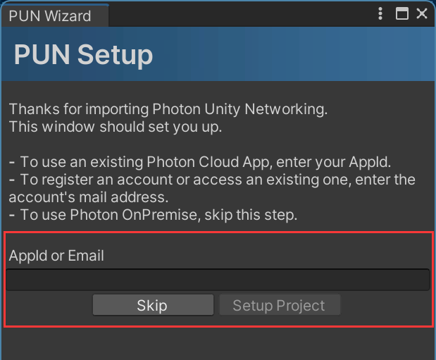
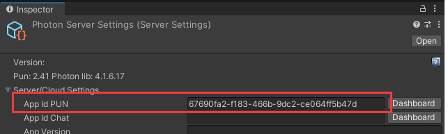
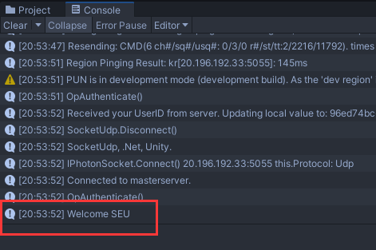
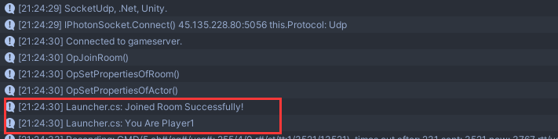

# PUN2使用文档


## 1 PUN2快速入门配置

### 1.1 客户端A连接到PUN2服务器

> [Photon文档](https://doc.photonengine.com/zh-cn/fusion/current/getting-started/fusion-intro)

1. [Photon官网](https://www.photonengine.com/pun)注册账号并CreateApp（AppID后面要用）

2. UnityAssetStore找到**PUN2-FREE**并Import

3. 在弹窗或Window/PUN/HighlightServerSettings里设置**AppID**

   

   

4. Window/PUN/HighlightServerSettings的一些其他设置

   - AppVersion: 1
   - Fixed Region：asia
   - NetworkLogging：ALL
   - PUNLogging: Full

5. Hierarchy窗口下新建空节点挂载Launcher.cs

   ```cs
   using System.Collections;
   using System.Collections.Generic;
   using UnityEngine;
   using Photon.Pun;
   
   public class Launcher : MonoBehaviourPunCallbacks
   {
       void Start()
       {
           PhotonNetwork.ConnectUsingSettings();
       }
   
       public override void OnConnectedToMaster()
       {
           base.OnConnectedToMaster();
           Debug.Log("Welcome SEU");
       }
   
       void Update()
       {
   
       }
   }
   ```

   运行后观察Console窗口，发现输出了想要的Welcome SEU，说明成功连接到服务器

   


### 1.2 对应客户端的人物生成和控制

1. 房间创建+NickName，更新Launcher.cs

   ```cs
   using System.Collections;
   using System.Collections.Generic;
   using UnityEngine;
   using UnityEngine.UI;
   using Photon.Pun;
   using Photon.Realtime;
   
   public class Launcher : MonoBehaviourPunCallbacks
   {
       public string RoomName = "Room";
       private string gameVersion = "1";
   
       [SerializeField]
       private const byte maxPlayersPerRoom = 4;
   
       void Awake()
       {
           PhotonNetwork.AutomaticallySyncScene = true;	// 确保该变量为 true，否则无法同步
       }
   
       void Start()
       {
           if (PhotonNetwork.IsConnected)  // 已连接，加入到房间
           {
               PhotonNetwork.JoinOrCreateRoom(RoomName, new RoomOptions() { MaxPlayers = maxPlayersPerRoom }, default);
           }
           else    // 未连接  
           {
               PhotonNetwork.ConnectUsingSettings();		
               PhotonNetwork.GameVersion = gameVersion;
           }
       }
   
       public override void OnConnectedToMaster()	// 运行ConnectUsingSettings()后会先连接到 Master节点，再创建或加载房间
       {
           Debug.Log("Launcher.cs: OnConnectedToMaster() was called.");
           PhotonNetwork.JoinOrCreateRoom(RoomName, new RoomOptions() { MaxPlayers = maxPlayersPerRoom }, default);
       }
   
       public override void OnJoinedRoom()
       {
           // 加入房间后用NickName进行区分
           if (PhotonNetwork.PlayerList.Length == 1)
           {
               PhotonNetwork.LocalPlayer.NickName = "Player1";
           }
           else if (PhotonNetwork.PlayerList.Length == 2)
           {
               PhotonNetwork.LocalPlayer.NickName = "Player2";
           }
   
           Debug.Log("Launcher.cs: Joined Room Successfully!");
           Debug.Log("Launcher.cs: You Are " + PhotonNetwork.LocalPlayer.NickName);
       }
   }
   ```

   

2. Player创建、移动脚本、同步组件

   - 创建Player的Prefab

   - 添加rigidBody组件（gravity重力）

   - 添加PlayerControl.cs控制移动（以下脚本不依赖相机视角控制方向）

     ```cs
     using System.Collections;
     using System.Collections.Generic;
     using UnityEngine;
     using Photon.Pun;
     using Photon.Realtime;
     
     public class PlayerControl : MonoBehaviourPunCallbacks
     {
         void Update()
         {
             // 确保各自控制各自
             if(!photonView.IsMine && PhotonNetwork.IsConnected)
                 return;
             float vertical = Input.GetAxis("Vertical");
             float horizontal = Input.GetAxis("Horizontal");
             Vector3 dir = new Vector3(horizontal, 0, vertical);
     
             if (dir != Vector3.zero) {
                 transform.rotation = Quaternion.LookRotation(dir);
                 transform.Translate(Vector3.forward * 2 * Time.deltaTime);
             } 
         }
     }
     ```

   - 添加**Photon View**组件和**Photon Transform View**组件

3. 创建好Player1和Player2的Prefab（目前为红蓝区分）

   - 把两个Player作为Prefab拖拽到Project-Assets/Photon/PhontonUnityNetworking/Resources中

   - 代码中加入Instantiate实例化的逻辑，更新Launcher.cs

     ```cs
     using System.Collections;
     using System.Collections.Generic;
     using UnityEngine;
     using UnityEngine.UI;
     using Photon.Pun;
     using Photon.Realtime;
     
     public class Launcher : MonoBehaviourPunCallbacks
     {
         public string RoomName = "Room";
         private string gameVersion = "1";
         [SerializeField]
         private const byte maxPlayersPerRoom = 4;
     
         void Awake()
         {
             PhotonNetwork.AutomaticallySyncScene = true;	// 确保该变量为 true，否则无法同步
         }
     
         void Start()
         {
             if (PhotonNetwork.IsConnected)  // 已连接，加入到房间
             {
                 PhotonNetwork.JoinOrCreateRoom(RoomName, new RoomOptions() { MaxPlayers = maxPlayersPerRoom }, default);
             }
             else    // 未连接  
             {
                 PhotonNetwork.ConnectUsingSettings();		
                 PhotonNetwork.GameVersion = gameVersion;
             }
             
         }
     
         public override void OnConnectedToMaster()	// 运行ConnectUsingSettings()后会先连接到 Master节点，再创建或加载房间
         {
             Debug.Log("Launcher.cs: OnConnectedToMaster() was called.");
             PhotonNetwork.JoinOrCreateRoom(RoomName, new RoomOptions() { MaxPlayers = maxPlayersPerRoom }, default);
         }
     
         public override void OnJoinedRoom()
         {
             // 加入房间后用NickName进行区分
             if (PhotonNetwork.PlayerList.Length == 1)
             {
                 PhotonNetwork.LocalPlayer.NickName = "Player1";
                 PhotonNetwork.Instantiate("RedPlayer", new Vector3(-21,2,-7), Quaternion.identity, 0);
             }
             else if (PhotonNetwork.PlayerList.Length == 2)
             {
                 PhotonNetwork.LocalPlayer.NickName = "Player2";
                 PhotonNetwork.Instantiate("BluePlayer", new Vector3(-21,2,-7), Quaternion.identity, 0);
             }
     
             Debug.Log("Launcher.cs: Joined Room Successfully!");
             Debug.Log("Launcher.cs: You Are " + PhotonNetwork.LocalPlayer.NickName);
         }
     }
     ```

     > 注意表示人物的Capsule由于加了Gravity会站不住倒下
     >
     > 可以把Rigidbody的Component下的Constraints的FreezeRotation全部勾选

### 1.3 第一人称

> - 摄像机第一人称的挂载
> - 鼠标控制方向键盘控制移动

需要丢弃PlayerControl.cs

在Player下挂载FirstPersonMovement.cs

```cs
using System.Collections.Generic;
using UnityEngine;
using Photon.Pun;

public class FirstPersonMovement : MonoBehaviourPun
{
    // 行走速度
    public float speed = 5;
    private Rigidbody rigidbody;
    // 快走
    [Header("Running")]
    public bool canRun = true;
    public bool IsRunning { get; private set; }
    public float runSpeed = 9;
    public KeyCode runningKey = KeyCode.LeftShift;
    // 覆盖移动速度的函数。将使用最后添加的覆盖。
    public List<System.Func<float>> speedOverrides = new List<System.Func<float>>();
    // 坐姿
    private CapsuleCollider capsulecollider;


    void Awake()
    {
        rigidbody = GetComponent<Rigidbody>();
        capsulecollider = GetComponent<CapsuleCollider>();
    }

    void Start(){
        // 防止PUN2多人时相机错乱
        if(!photonView.IsMine && PhotonNetwork.IsConnected){
            Destroy(GetComponentInChildren<Camera>().gameObject);
            return;
        }
    }

    void FixedUpdate()
    {
        // 防止PUN2多人时控制错乱
        if(!photonView.IsMine && PhotonNetwork.IsConnected)
        	return;
        // 有没有按下 runningKey
        IsRunning = canRun && Input.GetKey(runningKey);
        // 确定速度
        float targetMovingSpeed = IsRunning ? runSpeed : speed;
        // 覆盖移动速度的函数。将使用最后添加的覆盖。
        if (speedOverrides.Count > 0)
        {
            targetMovingSpeed = speedOverrides[speedOverrides.Count - 1]();
        }
        // 获取键盘or手柄
        Vector2 targetVelocity = new Vector2(Input.GetAxis("Horizontal") * targetMovingSpeed, Input.GetAxis("Vertical") * targetMovingSpeed);
        // 应用移动
        rigidbody.velocity = transform.rotation * new Vector3(targetVelocity.x, rigidbody.velocity.y, targetVelocity.y);
    }


    void Update()
    {
        // 防止PUN2多人时控制错乱
        if (!photonView.IsMine && PhotonNetwork.IsConnected)
        	return;
    }
}
```

在Player下的Camera下挂载FirstPersonLook.cs

```cs
using UnityEngine;
using Photon.Pun;

public class FirstPersonLook : MonoBehaviourPun
{
    [SerializeField]
    Transform character;
    public float sensitivity = 2;
    public float smoothing = 1.5f;

    Vector2 velocity;
    Vector2 frameVelocity;


    void Reset()
    {
        if(!photonView.IsMine && PhotonNetwork.IsConnected)
            return;
        // Get the character from the FirstPersonMovement in parents.
        character = GetComponentInParent<FirstPersonMovement>().transform;
    }

    void Start()
    {
        // Lock the mouse cursor to the game screen.
        Cursor.lockState = CursorLockMode.Locked;
        // CameraWork _cameraWork = this.gameObject.GetComponent<CameraWork>();
        // if (_cameraWork != null)
        // {
        //     if (photonView.IsMine)
        //     {
        //         _cameraWork.OnStartFollowing();
        //     }
        // }
        // else
        // {
        //     Debug.LogError("<Color=Red><a>Missing</a></Color> CameraWork Component on playerPrefab.", this);
        // }
    }

    void Update()
    {
        if(!photonView.IsMine && PhotonNetwork.IsConnected)
            return;
        // Get smooth velocity.
        Vector2 mouseDelta = new Vector2(Input.GetAxisRaw("Mouse X"), Input.GetAxisRaw("Mouse Y"));
        Vector2 rawFrameVelocity = Vector2.Scale(mouseDelta, Vector2.one * sensitivity);
        frameVelocity = Vector2.Lerp(frameVelocity, rawFrameVelocity, 1 / smoothing);
        velocity += frameVelocity;
        velocity.y = Mathf.Clamp(velocity.y, -90, 90);

        // Rotate camera up-down and controller left-right from velocity.
        transform.localRotation = Quaternion.AngleAxis(-velocity.y, Vector3.right);
        character.localRotation = Quaternion.AngleAxis(velocity.x, Vector3.up);
    }
}
```

> 调试时需要注意这么几点：
>
> 1. 由于Launcher.cs里的代码的Instantiate逻辑，在你运行后，会创建一个Player（从天而降），别懵圈
>
> 2. 因为1的情况，所以建议你在Hierarchy窗口调整好Player下挂载的cs后，更新Project-Assets/Photon/PhontonUnityNetworking/Resources中用于生成的Prefab，以同步、
>
>    - 当你直接在Hierarchy新建一个GameObject，左侧为透明的小方块
>    - 当你把这个GameObject拖拽到Project作为预制体，左侧为蓝色的小方块
>      - 此时，如果修改Hierarchy里的蓝色的GameObject的脚本，Project的预制体并不会同步修改
>      - 此时，如果点开Project的预制体修改，应该会同步到Hierarchy里的蓝色小方块的GameObject
>      - 此时，如果Delete掉Project的预制体，那么蓝色的GameObject会变红（不知道表示什么）
>      - 此时，如果想Project的预制体修改不被同步，可以右击Hierarchy里的蓝色的GameObject选择Prefab/Unpack（尚不知道Unpack和Unpack Completely的区别）
>
> 3. Display1：第三人称
>
>    Display2：RedPlayer
>
>    Display3：BluePlayer


### 1.4 Nickname逻辑优化 & 人物选择功能

位置：Launcher.cs的OnJoinedRoom()方法中

```cs
// 加入房间后用NickName进行区分
if (PhotonNetwork.PlayerList.Length == 1)
{
    PhotonNetwork.LocalPlayer.NickName = "Player1";
    PhotonNetwork.Instantiate("RedPlayer", new Vector3(0,0,0), Quaternion.identity, 0);
}
else if (PhotonNetwork.PlayerList.Length == 2)
{
    PhotonNetwork.LocalPlayer.NickName = "Player2";
    PhotonNetwork.Instantiate("BluePlayer", new Vector3(0,0,0), Quaternion.identity, 0);
}
```

目前逻辑是：

- 我作为Player加入房间后，看看房间总人数（算自己）
- 如果只有我1个，那我就是Player1，Instantiate一个RedPlayer给我控制。
- 如果发现算上我有2个，那我就是Player2，Instantiate一个BluePlayer给我控制。

需要修改的地方：

- 不能直接指定NickName = "Player1"
  而需要类似NickName = "Player" + PhotonNetwork.PlayerList.Length.ToString()的逻辑

- NickName命名的规范化，暂定就以Player`n`来命名，这个NickName在后续RPC传输数据时候需要用到
- 人物的选择，即Instantiate哪个预制体
  - 由于我们的Camera挂载在Player下，所以在Player没有被实例化的时候，Display里是黑色不显示的
  - 希望在JoinRoom之前，给一个UI界面供用户选择对应Avatar，进而在代码中确定Instantiate的预制体
    - 这个UI界面展示得了吗？
    - 选择的结果如何传输给Launcher.cs的OnJoinedRoom()方法中的参数？
    - 如果一直不选择怎么办？

